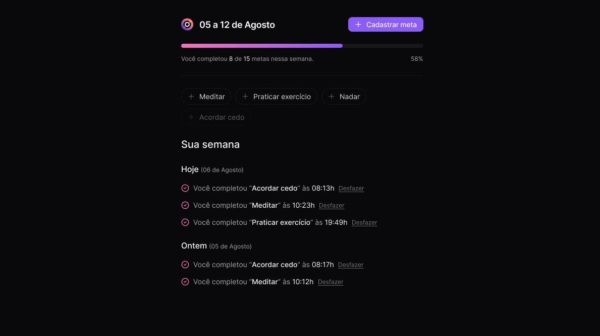

<p align="center">
  
</p>

<p align="center">
Aplicação desenvolvida no NLW Pocket Javascript da Rocketseat na trilha Nodejs.
</p>

<p align="center">
  <a href="#-tecnologias">Tecnologias</a>&nbsp;&nbsp;&nbsp;|&nbsp;&nbsp;&nbsp;
  <a href="#-projeto">Projeto</a>&nbsp;&nbsp;&nbsp;|&nbsp;&nbsp;&nbsp;
  <a href="#memo-licença">Licença</a>
</p>

<p align="center">
  
</p>

<br>

<p align="center">
  
</p>


## 🛠️ Tecnologias

Esse projeto foi desenvolvido com as seguintes tecnologias:

- Fastify
- Drizzle
- TypeScript
- Postgres
- Zod
- Dayjs

## 🚀 Projeto

Nesse projeto iremos criar o aplicativo In.orbit e um sistema de gerenciamento de metas. Este projeto consome a API desenvolvida na trilha de Node.js

O back-end da aplicação está disponível neste repositório: **nlw-pocket-nodejs**. Certifique-se de rodá-lo para que a aplicação front-end funcione corretamente.

## :clipboard: Clonando o repositório Back-end:
```sh
  git clone https://github.com/JuniorLima36/nlw-pocket-nodejs.git
```

### ▶️ Rodando Back-end:
```sh
  npm install
  docker compose up -d
  npm run db:generate
  npm run db:migrate
  npm run seed
  npm run dev
```


### :computer: Rotas HTTP
---
Cria uma nova meta.
#### POST <code>http://localhost:3333/goals</code>


#### Request body
```json
{
   "title": "Não usar o celular de noite",
   "desiredWeeklyFrequency": 2
}
```
---

Obter metas pendentes da semana. 

#### GET <code>http://localhost:3333/pending-goals</code>

```json
{
   "pendingGoals": [
      {
         "id": "z7arl2brhmdmgob4gvqebi22",
         "title": "Acordar cedo",
         "desiredWeeklyFrequency": 5,
         "completionCount": 1
      },
      {
         "id": "reko1jv7lf4e5l3yt1mokyib",
         "title": "Me exercitar",
         "desiredWeeklyFrequency": 3,
         "completionCount": 1
      },
      {
         "id": "ywnm1j8svb730giwd3bauk49",
         "title": "Meditar",
         "desiredWeeklyFrequency": 1,
         "completionCount": 0
      }
   ]
}
```
---

Criar conclusão de meta

#### POST <code>http://localhost:3333/completions</code>

#### Response body
```json
{
   "goalId": "ywa0zn9rcy1ncpgom246zzoy"
}
```
---

Obter resumo da semana

#### GET <code>http://localhost:3333/summary</code>

```json
{
   "summary": [
      {
         "completed": 2,
         "total": 9,
         "goalsPerDay": {
            "2024-10-20": [
               {
                  "id": "z7arl2brhmdmgob4gvqebi22",
                  "title": "Acordar cedo",
                  "completedAt": "2024-10-20T03:00:00+00:00"
               }
            ],
            "2024-10-21": [
               {
                  "id": "reko1jv7lf4e5l3yt1mokyib",
                  "title": "Me exercitar",
                  "completedAt": "2024-10-21T03:00:00+00:00"
               }
            ]
         }
      }
   ]
}
```
